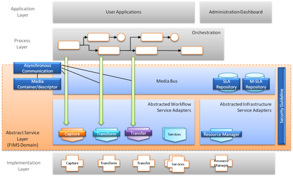
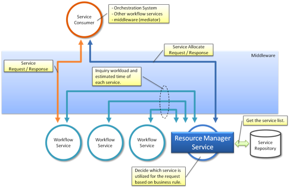

  __EBU Tech 3356__ 
# Specification of the FIMS Media SOA Framework
### General Description - Version 1.3

_Previous_: [Overview](./overview.md) | _Up_: [Contents](./introduction.md) | _Next_: [Media service management](./mediaServiceManagement.md)

## High-level architectures

### What does it mean to be 'FIMS Compliant'?

Compliance with FIMS requires that the following conditions shall be met:

1. Messages shall be implemented as described in the FIMS service description framework.
2. Message names or defined schemas shall not be modified.
3. Messages shall not be processed in a means that is dependent on schema extensions.
4. In the case of SOAP implementations, each service interface shall comply with the FIMS WSDL. For REST implementations, 
   messages shall comply with the header and body REST mappings defined by the specification for each service. Message 
   payloads shall validate with the FIMS schema.
5. In the case of SOAP implementations, each service shall implement at least the mandatory parts of the FIMS WSDL 
   definitions. Similarly, REST implementations of services shall implement at least the mandatory parts defined in 
   the common FIMS schemas. Definitions shall not be extended except for fields that explicitly allow vendor extensions.

__Everything from here on in this section is what FIMS isn't, does not do and does not have a mandate to do!!!__

### Reference architecture(s)

The following figure shows he overall reference model of the FIMS framework, including areas not specified in FIMS.

To take account of the specific needs of audiovisual media, the FIMS framework has to consider aspects of media services 
that may differ from conventional IT-based SOA such as:

1. Asynchronous communication to properly handle the very large amounts of data associated with AV media in a timely manner.
2. Media Container/Media Descriptor to associate AV metadata with AV essence.
3. Media Infrastructure Service (Resource Manager) for appropriate media handling.
4. Media Bus for AV data exchange, in addition to the conventional ESB for XML message exchange.
5. Media Bus M-SLA (Media-Service Level Agreement), in addition to the conventional SLA in ESB.
6. Security guidelines for secure media handling.

Not all of these aspects are addressed in this version of the specification. It is a goal of the FIMS Task Force to address 
all aspects in future versions.

[Media-centric issues](#meida-centric-issues) are discussed below.

__Figure 2 and description removed - should add other scopes__

The reference architecture is capable of working with different SOA architectural approaches, supporting SOAP/WSDL and 
RESTful interaction styles.

### Service taxonomy

A system with FIMS components contains two broad service categories: 

1. workflow services able to realize a given business goal (Media Workflow services);
2. infrastructure services that are essential components of the Media SOA system (Media Infrastructure services).

Infrastructure services that are used to construct the Media SOA system are called Media Infrastructure (MI) services. 
The MI services could (in the future) include a Resource Manager that conducts the resource allocation, as well as 
other common services like job scheduling and queuing.

Depending on the type of business workflow, the number and type of media services used may vary.

### Scenarios: Mediations, dynamic resource allocation

The FIMS framework has been conceived in such a way as to allow the implementation of systems with varying levels 
of complexity, depending on the objectives, operational environment and user expectations.

At the simplest level, services can be invoked directly by consumers (user interface clients or orchestrators), 
without any intermediate software layer. In this case the workflow orchestrator takes all the responsibility for 
any supporting operation such as service discovery, resource balancing, etc. In small to medium environments this 
may be appropriate. In more complex installations, where several processes must run in parallel and compete for 
resources, it may be convenient to centralize the management operations in an intermediate software layer. This is 
usually referred to as the Enterprise Service Bus (ESB). 

Features that can be associated with an ESB include:

* centralised enforcement of security;
* dynamic resource allocation;
* service registry management; 
* load balancing;
* fault tolerance;
* mediation operations, such as protocol translation (for example, from SOAP to REST).

The definition of functionalities that such an intermediate layer should have is outside of the scope of this version 
of the specification.

### Media-centric issues

#### Asynchronous operations for long running process

SOA-based media workflows are often long running processes, sometimes active for hours, days, or even weeks. This places 
specific persistence requirements of the SOA BPM platform. Servers may be stopped or restarted while processes are running. 
The system needs to be able to restart at the same point in the workflow and process orchestration without loss or state 
or data.

Many SOA-based media services run on external hardware or are software-based systems that operate in a loosely coupled 
asynchronous environment. If the orchestration system is stopped, these services may continue running, and the job process 
states have to be recovered after the system restarts.

Asynchronous operation status updates may be implemented with either callbacks or polling depending on SOA platform 
architecture.

The [section on media service behaviour](./mediaServiceBehaviour.md) discusses asynchronous communication.

#### Process scheduling and resource management

Because of long processing time resulting from the huge size of AV data, process scheduling and resource management can 
be crucial for SOA-based media systems.

Although the concept of the Resource Manager Service (see Figure below) includes process scheduling and resource management, 
process scheduling may be invoked by only the orchestration system. The Resource Management service may be invoked by 
the orchestration system, by the mediator in the middleware, or by any of the workflow services.

The interface for a Process scheduling service could be hidden if it is only invoked within the closed orchestration 
system because it is left to the orchestration system developer. However, if it is also to be used by the workflow 
services, the Resource Manager interface will need to be defined as a part of the FIMS framework. This is not addressed 
in the current version of the specification.

#### Media Bus

An extension to SOA often called the "Media Bus" can facilitate storage and media file centric operations. The Media Bus 
extension is similar to an Enterprise Service Bus (ESB) optimized for large files.

Since the system manages the storage and movement of a very large number of large files (sometimes millions of files 
per project) it is important that an asset data repository be available as part of the system core functionality, or 
as an external (third party) service.

There can be many copies of file instances and also many versions located in multiple storage areas. There may also be 
many lower resolution video proxy files in the system representing the original high resolution "camera negative" files 
or file sequences. It is necessary to be able to keep track of all these proxy files, including the different versions 
that may exist.

##### M-SLA

The performance of the individual components of the Media Bus (mainly storage devices) such as bandwidth, transfer 
speed, capacity, may need to be queried using a common message format.

Based on this, a client such as the orchestration system and/or the media infrastructure service can select the 
storage device that is best suited to the client, and/or more precisely estimate the execution time to be requested.

This corresponds to SLA in a conventional IT-based SOA system and is referred to as M-SLA. Because the detailed 
specifications of M-SLA need to be harmonized with SLA, this will need to be need to be discussed by the FIMS 
boards at a later date in accordance with SLA developments.

#### Security

Due to the high value of the intellectual property passing through media systems, it is critical that security be 
maintained and access provided only to those with proper authorization. There are several types of security that 
can be implemented across the SOA: agent‐based security, message based security, watermarking, and Digital Rights 
Management. Typical media enterprises will require most if not all of these security provisions. Agent based security 
involves keeping track of the various participants in the SOA-based media system, and doing this correctly will no 
doubt require some sort of identity management infrastructure.

Identity management technology is well developed in IT, and can be put to very good use in SOA middleware. Instead of 
using disparate repositories and application‐specific methods to authenticate users and secure systems, identity 
management tools allow the integrator to unify all of an enterprise under a single repository and management system 
of user data. This allows easy changes to user information and quick provisioning of new users. In an integrated SOA, 
identity management solutions also allow for role‐based views into data.

It is intended that a future version of the FIMS specification will provide guidelines on selection of appropriate 
technologies from existing security standards.

* * *

_Previous_: [Overview](./overview.md) | _Up_: [Contents](./introduction.md) | _Next_: [Media service management](./mediaServiceManagement.md)

Copyright 2015 European Broadcasting Union

Copyright 2015 Advanced Media Workflow Association
