  __EBU Tech 3356__ 
# Specification of the FIMS Media SOA Framework
### General Description - Version 1.3

_Previous_: [Media service awareness](./mediaServiceAwareness.md) | _Up_: [Contents](./introduction.md) | _Next_: [Annex 1: Future visions](./pipelined.md)

## Media service behaviour

### Common service behaviour

#### Resource-oriented dialogue

Communication in FIMS consists of a dialogue of messages about the FIMS-defined resources (job, queue, service, profile, 
BMObject etc.) between a service and its client. An operation of a media service is executed through a dialogue about a 
job resource between the service provider and the operation requester.

FIMS defines a set of well-known operation implementation patterns that are supported through the SOAP/WSDL and RESTful 
service definitions provided, as described in [the next section](#operation-implementation-patterns). The corresponding 
messages embed representations of resources and/or resource references by identifiers as parameters to operations. The WSDL 
and RESTful service definitions provide for synchronous and asynchronous requests, responses, faults and notifications.

The RESTful approach to FIMS uses standard HTTP verbs with URI paths to achieve the same dialogue, with the resource 
description embedded directly as the message body. The specification of specific bindings between the HTTP verbs, headers, 
status codes, the FIMS-defined operation patterns and a RESTful event mechanism for notifications is provided with this 
version of the FIMS specification.

> Note that one service provider could simultaneously support both SOAP/WSDL and RESTful interaction styles for the same 
  resources.
  
The following figure shows an example sequence diagram of Capture Request/Ack using the SOAP approach.

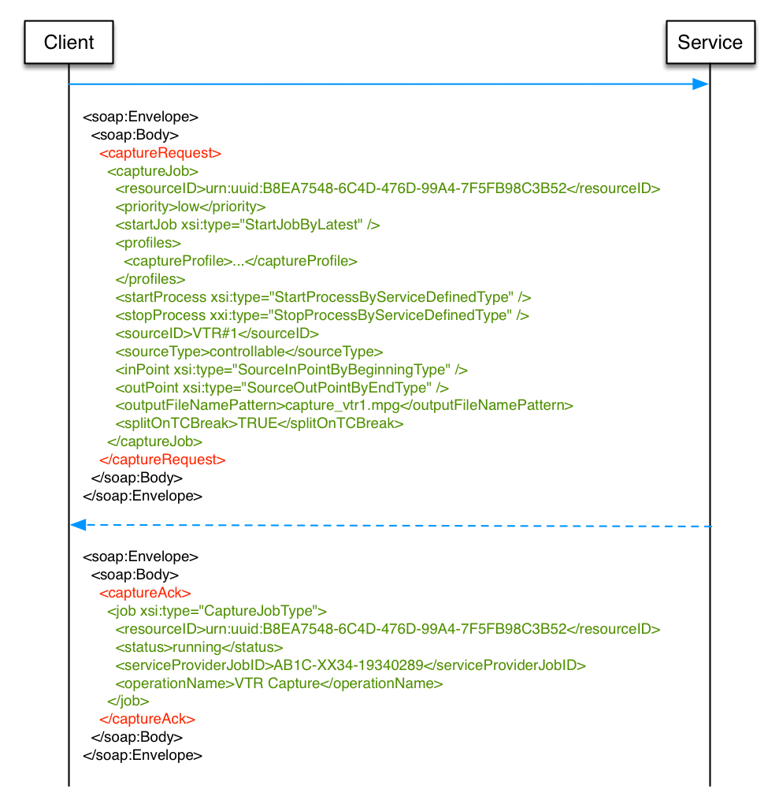

The RESTful equivalent carries the part of the Capture Request message coloured in green as the body of a message POSTed 
to a service. If successful, the synchronous HTTP response has a status code of 201 Created with a body similar to the 
green part of the Capture Ack message.

The content type of a RESTful FIMS message body shall be represented in either XML or JSON format. Definition of the 
mapping of the FIMS XML schema definitions to JSON format messages is provided in __Section 8.3 FIX LINK__.

The body of an example JSON Capture Request message is shown in the figure below.

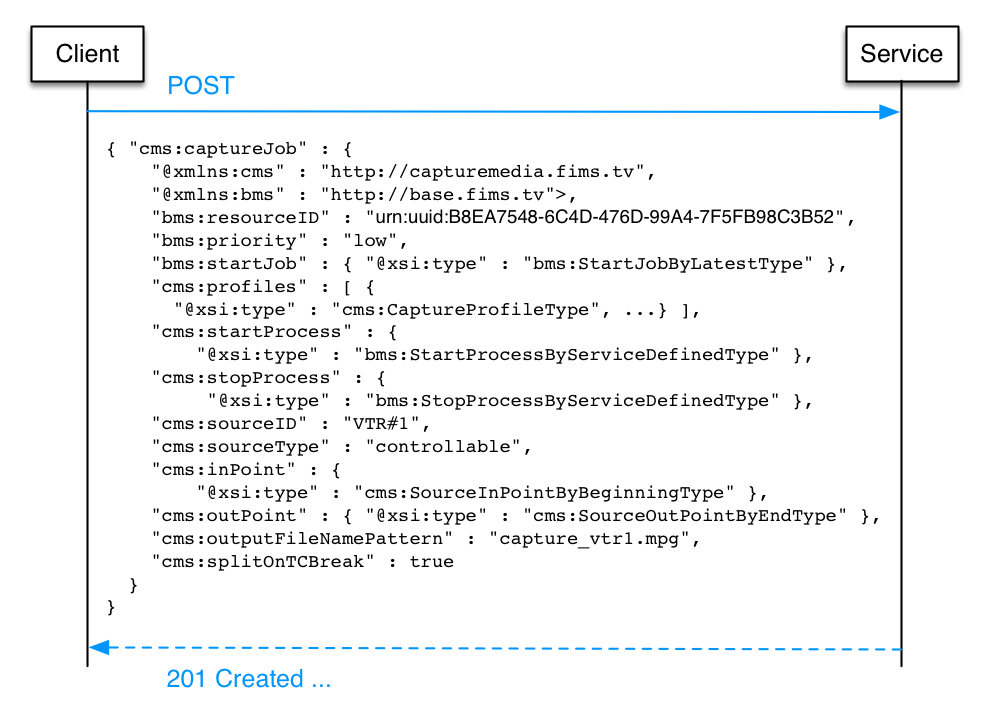

#### Operation implementation patterns

Service operations defined by FIMS interfaces provide different types of interactions between the service provider and 
the service requester. Each one specifies how the result of an operation is made available to the requester. The 
interface definition along with the input parameters of the operation determines how the service should return the 
response of the operation.

##### Synchronous request/response

In this interaction mode the service client (e.g. a business process) invokes the service to perform an operation passing 
the input parameters (_par1_, ... _parN_) and receives the response in the same communication session as the request. Operations 
that implement this mode of interaction should not be long-running processes to avoid blocking the service client for a long 
period of time and to prevent timeouts that may occur in the communication session. See the figure below.

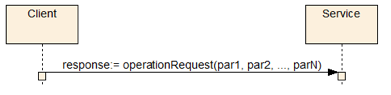

Examples of operations that use this type of interaction are the job and queue management operations.

##### Asynchronous request/response with notification

This interaction pattern should be used for long running processes. The request and response associated to the operation 
are exchanged in two different communication sessions. The request session includes the invocation by the client of an 
operation passing the input parameters (_par1_, ... _parN_, _jobGUID_, _notifyAt_) and the acknowledgement by the service 
that the request was received. A service shall return an acknowledgement when it is ready to respond to any further actions 
for that request from the orchestration system. See the figure below.

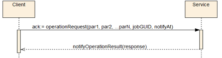

The _jobGUID_ parameter identifies uniquely the job request from the business process (the service client) point of view. The 
_notifyAt_ parameter specifies to the service provider where to send the response message when the operation execution 
completes. It also specifies where to send an error notification message if the service fails during its execution. The 
_notifyAt_ parameter shall be provided for the service to operate in this mode (see `AsyncEndpointType` definition).

A separate communication session is used to send the response message to the address specified by the _replyTo_ element of 
the _notifyAt_ parameter. If an error occurs during the process of the operation an error notification should be issued to 
the endpoint specified by the _faultTo_ element of the _notifyAt_ parameter.

An example of operation that employs this interaction mode is the transform operation of the Transform Media service. See the 
figure below.

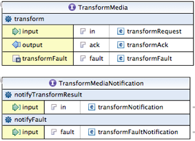

WSDL/SOAP requests shall have WSDL/SOAP notifications. RESTful requests shall have RESTful notifications.

For a RESTful asynchronous request, notifications shall be sent to the replyTo and faultTo endpoints provided by the defined
by the RESTful notifications table provided with each service.

The body of a RESTful notification message shall be the service-specific notification type (e.g. `CaptureNotificationType`) 
for a reply and the service-specific fault type (e.g. `CaptureFaultType`) for a fault, as defined by the RESTful notifications 
table.

A RESTful notifications table shall have the following columns:

* __Description__ - An informative description of the reason for the notification.
* __HTTP method__ - The HTTP method that shall be used to send the notification (normally POST).
* __Body__ - Type of the body of the notification that shall be defined by reference to the service-specific XML schema or 
base XML schema.
* __Generation events__ - The events that cause a notification to be sent, such as job creation or job failure.

##### Asynchronous request/response with polling – WSDL/SOAP

This is another interaction pattern for long running processes, where the preferred interaction pattern is not possible 
(e.g. a firewall preventing a service to call back a client). It is similar to the [asynchronous request/response with 
notification](#asynchronous-requestresponse-with-notification) interaction mode with the exception that a notification 
is not sent by the service when the service completes the operation. The _notifyAt_ parameter shall not be provided for 
the service to operate in this mode. See the following figure.

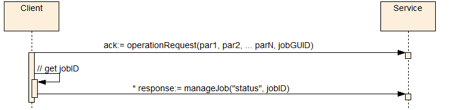

When the client issues the request, it receives an acknowledgement message that contains the ID of the job as identified 
by the service.

In this mode of interaction, it is the responsibility of the client to poll the service, using the _queryJob_ operation, 
to retrieve its queue status, running status and the result of the operation once it is completed. This is achieved using 
the _resourceID_ of the job (that is part of the acknowledgment message). Once the job completes its execution the response 
message for the status request brings back the result of the operation.

The result of the job execution is contained in the jobs element. This element shall be present when retrieving the job 
information after the service completes the operation. The same information that would be part of the notification message 
in the pattern specified in the [previous section](#asynchronous-requestresponse-with-notification) shall be present in 
this field.

A transform operation of the Transform Media service may be implemented using this type of interaction.

WSDL/SOAP implementation of FIMS services shall support either Notification or Polling.

##### Asynchronous request/response with polling - RESTful

Every resource created by a service has a unique identity through which it can be addressed with a URI. This URI will have 
been returned in the `Location` header of the response message synchronously following the successfully created the resource. 
At any time between when a resource is created and deleted such that it has an addressable endpoint, the status of that 
resource shall be made available through a HTTP GET request to the URI for that resource.

##### Level of detail – all RESTful request/response types

The amount of detail returned by GET request for a resource shall be configurable using a _detail_ query parameter as part 
of the URI. This performs a similar function to the `BMConentFilterType` used in some SOAP calls. This parameter shall 
support at least the following three levels for all resources:

* _link_ or _min_ - Properties of the `ResourceReferenceType` only, providing ust enough information to locate and identify 
  the revision identifier for a resource.
* _summary_ - Important fields of the resource itself and those of any types that the resource extends, as defined by a 
  service implementation. All collections of elements shall be collapsed so that the items in the collection are displayed 
  as links only.
* _full_ - Full details of the resource including all fields with data, however important, and with all collections fully 
  expanded so that every item is also provided with full detail.

The following three levels should be supported for `BMContentType` resources:

* _metadata_ - The operation will return the matching contents with the metadata properties only populated.
* _physical_ - The operation will return the matching contents with the physical (essence) fields only populated.
* _specific_ - The operation will return the matching contents with the specific pre-defined fields only populated. The 
  specific filter is defined as part of the RCR (_Repository Capability Registry_).
  
For example, here is the URI for a GET request to get the details of a capture job, with only the most basic of details 
returned:

    http://capture.device7.acme.com/fims/job/AF7E4D2F-E981-4F66-B157-2026821E3102?detail=link

If the job is known to the service, a 200 OK response is generated as follows:

    <cms:captureJob ...>
      <bms:resourceID>urn:uuid:AF7E4D2F-E981-4F66-B157-2026821E3102</bms:resourceID>
      <bms:revisionID>2</bms:revisionID>
    </cms:captureJob>

If the job is not known to the service, a 404 Not Found response is generated, containing a fault message:

    <cms:captureFault ...>
      <bms:code>DAT_S00_0003</bms:code>
      <bms:description>Invalid jobID - the supplied jobID does not exists.</bms:description>
      <bms:detail>The given job identifier 'AF7E4D2F-E981-4F66-B157-2026821E3102' is not
        known to this device.</bms:detail>
    </cms:captureFault>

All the jobs currently known to a service may be listed using the job resource with the job identifier omitted. 
Query parameters _skip_ and _limit_ may be used to control the pagination of collections of results, such as a list
jobs:

* _skip_ - Skip over the givien number of record before starting a page of results. The default value when the 
  parameter is omitted is zero, in other words the default behaviour is to skip no results.
* _limit_ - Limit the number of results to the given number per response. The default value is service specific.

A service shall support one or both of XML and/or JSON representations. Where both formats are supported, a client 
may choose a format using an Accept header with the MIME type of preferred response format. A service that implements 
the requested representation shall respond with a message of that type, otherwise it shall respond with a fault.

#### Input and output media

Media services often deal with media files. These services may consume and/or produce files that represent media 
essences. References to these media files are passed in the input and output messages for these services. Media is 
represented as by a Business Media Object (`BMObjectType`), as described in the 
[schema](../WSDL-REST-XSD/baseMediaService.xsd).

##### Processing the input media

There are operations that require only a media essence (or list of essence), like transforming media content. In this 
case the service receives a container object (of type `BMObjectType`) with a list of content objects that extends the 
abstract type `BMContentType`, which represents the media essence(s) the service should operate on.

##### Producing the output content

Services such as Transform Media produce new media essence (or a list of media essence). These services return one or 
more content objects (of type `BMContentType`) as a result of the operation.

#### Error and exception handling

Errors and exceptions detected by the service during the execution of job requests shall be returned to the service 
requester. For [synchronous operations](#synchronous-requestresponse) the fault message shall be returned as a response
to the request. See the figure below.

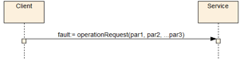

The fault message may contain detailed information about the error, as illustrated below.

The FIMS framework defines the enumeration of error codes and their description for each one of the service categories. A 
number of errors are common to all service categories and are presented in the `FaultCodeType` of the 
[base schema](../WSDL-REST-XSD/baseMediaService.xsd).

For asynchronous operation ([notification](#asynchronous-requestresponse-with-notification), 
[polling - WSDL/SOAP](#asynchronous-requestresponse-with-polling--wsdlsoap), [
polling - RESTful](#asynchronous-requestresponse-with-polling---restful)) , errors may occur in two distinct phases. An 
error or exception may be thrown at the request time (e.g. Invalid Request Parameters) and a fault message shall be returned 
immediately as a response to the request. The behaviour is similar to the synchronous scenario.

On the other hand if an error is detected during the execution of a long-running process (e.g. job failed) and the 
_notifyAt_ parameter has been set in the request message, then an error notification message shall be sent to the 
destination specified by _faultTo_ property of _notifyAt_. See the following figure.

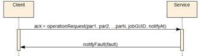

The recipient of the error notification message shall implement an interface defined by the service. For example for 
WSDL/SOAP, in the case of the _Transform Media_ service the recipient implements the _notifyFault_ operation specified 
by TransformMediaNotification, as shown below.

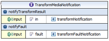

#### Failure recovery

A service failure during the execution of a workflow should be a recoverable process. The framework allows for the retry 
of the failed service since in many cases the cause of the failure can be easily fixed by human intervention. In this 
scenario the workflow is paused at the invocation of the failed service and can be restarted manually after the service 
is fixed.

The framework also allows for the definition of a compensation mechanism in the workflow to rollback to a well-defined 
condition when the failure cannot be recovered by a simple retry mechanism.

#### Job queue

A service may implement a queue to support multiple simultaneous requests. If implemented, job requests are en-queued in 
the order of priority and arrival. The service de-queues the jobs and processes them one by one. Multiple jobs can be 
de-queued at once if the service supports the execution of multiple simultaneous jobs (multi-threading).

The figure below shows the states associated to the job queue and the transitions initiated by the queue commands issued 
to the service. The states are associated to the processes that en-queue (accepts new jobs) and de-queue (starts execution 
of an en-queued job) requests. The _Started_ state means that both the en-queuing and de-queuing processes are active. 
_Locked_ means jobs cannot be en-queued but they are still being de-queued. _Stopped_ means jobs are not being either 
en-queued or de-queued.

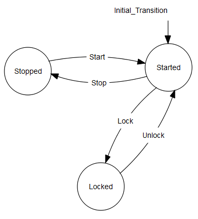

The service shall implement the manageQueue operation to process queue commands. In case the service does not implement a 
queue it shall respond with "Feature Not Supported" error code (SVC_S00_0015).

A job queue may have a maximum size and when it is reached no more jobs will be accepted. A fault indicating the queue is full 
shall be thrown by the service when a client issues a new job request (SVC_S00_0008).

#### Job execution priority

The service should execute requests in the order of priority. The priority of a job is indicated in the request message. 
Higher priority jobs take precedence over lower priority jobs.

The framework defines level of priority for the request. The list of possible values for priority are: _low_, _medium_, 
_high_, _urgent_ and _immediate_.

* A new job with _low_ priority shall be allocated at the end of the queue.
* A new job with _medium_ priority shall be allocated for execution prior to any _low_ priority job but after existing 
  _medium_ priority jobs.
* A new job with _high_ priority shall be allocated for execution prior to any _medium_ and _low_ priority job but 
  after existing _high_ priority jobs.
* A new job with _urgent_ priority shall be allocated for execution prior to any _high_, _medium_ and _low_ priority 
  job but after existing _urgent_ priority jobs.
* A new job with _immediate_ priority should be executed as soon as the job request is received.

If the service can process only one job at a time and the job being executed has a lower priority than a new requested job, 
the existing job shall continue its execution till completion and only then the new job processing should start.

Except for a job with _immediate_ priority, prioritization shall only affect jobs that are in the queue. To change what is 
actually running shall require an explicit operation, which is out of the scope of this specification.

#### Media referencing

FIMS media services operate on content essence. In order to describe interoperability of content essence, a unified 
mechanism to reference essence and metadata is required. This Section describes an object model that provides a simple 
mechanism to support the FIMS requirements: the Business Media Object (`BMObject`). A `BMObject` provides business-level 
information on the media content exchanged by FIMS services (such as location of the media, format and size). The `BMObject` 
provides visibility at the business process level of the media content, thus the term _business_ - to indicate that this 
is a business-level object, which does not overlap with existing standards for the description of media and metadata, but 
rather provides a convenient mechanism to interoperate transparently with such standards. The `BMObject` can be as simple 
as a URL to the media content and a description, yet it is very flexible, since it can represent complex content models 
and provides a mechanism for transporting metadata as needed.

The `BMObject` model provides a simple reference to content essence files based on the `BMContentType`, and a minimum set 
of descriptive and technical metadata properties, based on [EBU Tech 3293 (EBU Core Metadata 
Set)](https://tech.ebu.ch/publications/tech3293). This can be used by the FIMS framework to make business rules driven 
decisions, such as selecting the best transform media service for a job based on the content format or the size of the content.

Future extensions of the framework may extend the `BMObjectType` with different kinds of collections of content. For example:

* Different editorial cuts of the same television program.
* A complex mapping of the relationship between input and output content.

##### Partial media reference

From FIMS v1.2 onwards, three means of referencing partial media are provided, for example between a timecode start and end:

1. The Capture service has parameters for _in points_ and _out points_. This allows the capture device to be controlled so
   that it only captures part of a source.
2. Services including Transfer and Transform have _contentPartAtom_, _simpleEDLAtom_ and _wholeContentAtom_ elements that can be used 
   to specify input media for a job that may be only part of the source material.
3. `BMContentType` has a nested _timelines_ property of `TimelinesType`, where each _segment_ (`SegmentType` such as 
  `BMContentPartType`) of the timeline can be used to describe metadata about a time-bounded part of the content, including 
  its original source and/or descriptive metadata.
  
#### Jobs

An essential aspect for the management of long-running media operations is the ability to check the status and interact 
with requested jobs. For example, the following tasks might be performed for transcoding operations:

* Check the status of a job or list of jobs
* Cancel an active job
* Pause an active job
* Stop an active job
* Change priority of a job
* Clear a queue
* Lock/unlock a queue

The adoption of a common interface for the status operations enables the use of common front-end tools for media services 
management, and the ability to interact with running tasks from a client or workflow. Queue and Job management types provide 
a mechanism to query and manage the status of jobs and job queues.

#### Errors

The base schema defines a fault type that can be extended by specific FIMS service classes to provide service-class specific 
error codes. One of the benefits in utilizing a media service abstract class is the definition of a common set of errors. 
This definition allows the client requesters to implement different error handling logic for each individual service 
provider used. With this approach, the client can implement a general compensation or error handling logic for all service 
providers that support a FIMS service specification.

### Service interface overview

This section gives two common functions of service interfaces: Time Constraints and Profiles.

#### Time constraints

Time Constraints are time-related constraints during the job execution that are specified in 
the service request message. Time Constraints consist of the following four parameters:

1. _startJob_

  _startJob_ is one of the elements of the `JobType`, and is applicable to any service. It specifies the system time 
  when the  job shall start. Usually, this indicates the time at which a request message is extracted from the queue 
  and is moved to the _running_ state.
  
  There are the following three types to specify the time parameter of _startJob_:
  * NoWait type: execute immediately
  * Time type: the time to start
  * Latest type: the latest time at which a process can be started at the _startProcess_ properly.
  
2. _startProcess_

  _startProcess is a parameter for services that need to handle a real-time stream function such as Capture or Playout, 
  and specifies the system time at the start of the stream process.
  
  There are the following four types to specify the time parameter of _startProcess_, which may need to be frame accurate:
  * NoWait type: execute immediately
  * Time type: the time to start
  * TimeMark type: the time at which the TimeMark embedded in essence such as a timecode is detected
  * ServiceDefinedTime type: the time defined by a service
  
  A service that supports Time and/or TimeMark type shall declare this in the Service Description.

3. _stopProcess_

  _stopProcess_ is a parameter for services that need to handle a real-time stream function such as Capture or Playout. 
  This specifies the time when the stream process shall stop.
  
  There are the following five types to specify the time parameter of stopProcess, which may need to frame accurate:
  * OpenEnd type: the time at which a stop command is received
  * Time type: the time to stop
  * TimeMark type: the time at which the TimeMark embedded in essence such as a timecode is detected
  * Duration type: the time at which point the specified duration has elapsed since _startProcess_
  * ServiceDefinedTime type: the time defined by a service
  
  A service that supports Time, TimeMark, and/or Duration type shall declare this in the Service Description.
  
4. _finishBefore_

  _finishBefore_ is one of the elements of the `JobType`, and is applicable to any service. It specifies the time 
  by which the job shall have been completed.
  
  _finishBefore_ also specifies the deadline for the job execution. For example, in the case of specifying TimeMark 
  type in the _stopProcess_, it can be used as a timeout time. When _finishBefore_ is exceeded before the job is 
  completed, the service shall notify "SVC_S00_0016: Deadline passed" to the orchestration system.
  
  If the service cannot accommodate the time constraint, the service shall notify the error code SVC_S00_0017 to the 
  orchestration system: “Time Constraints in request cannot be met”.
  
  A service that can control the job completion time by using finishBefore shall declare this in the Service Description. 
  Even if a service does not itself support the function to control the job completion time, an orchestration system 
  should specify _finishBefore_ as a deadline.
  
##### Use Cases on time constraints

The table below shows possible use cases with the combination of _startProcess_ and _stopProcess_.

| startProcess       | stopProcess        | Description                                                        |
|:------------------:|:------------------:|:-------------------------------------------------------------------|
| NoWait             | OpenEnd            | Start ASAP, stop when stop command (manageJobRequest) is received. |
|                    | TimeMark           | Start ASAP, stop when the specified timeMark is detected.              |
|                    | Time               | Start ASAP, stop at the specified time.                            |
|                    | ServiceDefinedTime | Start ASAP, stop at the service defined time.                      |
|                    | Duration           | Start ASAP, stop when the specified duration has passed.               |
| TimeMark           | OpenEnd            | Start when the specified timeMark is detected, stop when stop command (manageJobRequest) is received. |
|                    | TimeMark           | Start when the specified timeMark is detected, stop when the specified timeMark is detected. |
|                    | Time               | Start when the specified timeMark is detected, stop at the specified time. |
|                    | ServiceDefinedTime | Start when the specified timeMatk is detected, stop at the service defined time.   |
|                    | Duration           | Start from the specified timeMark is detected, stop when the specified duration has passed. |
| Time               | OpenEnd            | Start from the specified time, stop when stop command (manageJobRequest) is received. |
|                    | TimeMark           | Start from the specified time, stop when the specified timeMark is detected. |
|                    | Time               | Start from the specified time, stop at the specified time.         |
|                    | ServiceDefinedTime | Start from the specified time, stop at the service defined time.   |
|                    | Duration           | Start from the specified time, stop when the specified duration has passed. |
| ServiceDefinedTime | OpenEnd            | Start at the service defined time, stop when the stop commmand (manageJobRequest) is received. |
|                    | TimeMark           | Start at the service defined time, stop when the specified timeMark is detected. |
|                    | Time               | Start at the service defined time, stop at the specified time.     |
|                    | ServiceDefinedTime | Start at the service defined time, stop at the service defined time. |
|                    | Duration           | Start at the service defined time, stop when the specified duration has passed. |

##### Sequence diagram examples

The figure below shows an example of the Capture Service sequence diagram in terms of Time Constraints. The source type of 
this example is VTR and both inPoint and outPoint are the specified time code.

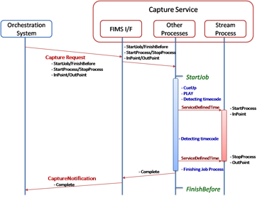

A service receives a request message from an Orchestration System. The service starts job at _startJob_, and performs some 
actions such as cueing up to the inPoint, starting playback and detecting specified time code. Of importance is that the
instruction of how and when to control the device is not included in the request message. The service manages to control the 
device by itself according to the information such as _startProcess_/_stopProcess_, inPoint/outPoint in the request message. 
A capture process starts at the serviceDefinedTime; it will stop at another serviceDefinedTime. After some finishing job 
process is performed, a CaptureNortification is issued to the Orchestration System to report completion.

The following figure shows the case where Time Constraints in the request message cannot be met for some reason. This can 
occur when a service receives the request message, or during queuing, or even during running. In this case, the service 
shall issue a CaptureFault with the error code “SVC_S00_0017: Time Constraints in request cannot be met" to the 
Orchestration System.

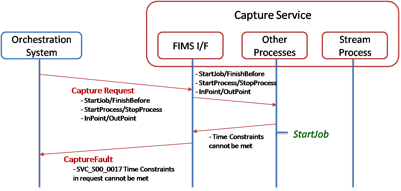

The final sequence diagram below shows the case where the time specified by _finishBefore_ has passed before the 
capture process has been completed. In this case, the service shall issue CaptureFaultNotification with the error 
code "SVC_S00_0016 Deadline passed" to the orchestration system. After issuing the CaptureFaultNotification, the 
service should wait for the next instruction from the orchestration without stopping the process.

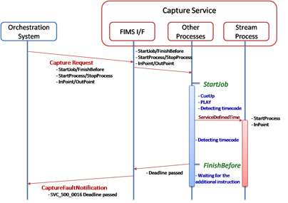

#### Profiles

Requests to any FIMS service interface shall include a profile that describes the specific operations that will take place 
as part of that request. Profiles themselves are composed of parameters specific to that service interface and generic 
elements that are available for re-use between interfaces. These reusable elements are combined into groups referred to 
as _Atoms_.

Profile structures are specified for each service interface that FIMS defines. Profiles inherit from _ProfileType_, which is 
used to provide a common basis for all profiles (figure below).

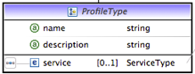

Profiles can be shared between jobs and [included by reference](./mediaServiceManagement.md#resource-oriented-data-model).

Where possible, implementations should use the specified profile.

The figure below shows an example of a request with two Capture profiles being used to create main stream essence 
(J2K + MXF) and proxy essence (AVC + MP4) and outputting though different transfer atoms (possibly to different 
locations over different transports).

### RESTful service interfaces

This Section defines the RESTful representation of FIMS values in REST messages and how RESTful services are defined. 
The rules of this Section are to a REST services what the WSDL files are WSDL/SOAP services.

REST service definition tables shall be used to define FIMS RESTful services. These tables shall be included as 
documentation with the XML schema documentation for each service. Each table makes reference to elements of the schemas 
that define the XML or JSON representation of the body of a REST message.

#### Namespaces for REST service definition

The table below defines the namespaces and prefixes that shall be used for the definition of REST services in the XML schema.

| Schema name                      | Prefix | Namespace                                                            |
|:---------------------------------|:------:|:---------------------------------------------------------------------|
| Base meida service               | bms    | [http://base.fims.tv](../WSDL-REST-XSD/baseMediaService.xsd)         |
| Base time values                 | tim    | [http://baseTime.fims.tv](../WSDL-REST-XSD/baseTime.xsd)             |
| Transfer media service           | tms    | [http://transfermedia.fims.tv](../WSDL-REST-XSD/transferMedia.xsd)   |
| Transform media service          | tfms   | [http://transformMedia.fims.tv](../WSDL-REST-XSD/transformMedia.xsd) |
| Capture media service            | cms    | [http://captureMedia.fims.tv](../WSDL-REST-XSD/captureMedia.xsd)     |
| Repository service               | rps    | [http://repository.fims.tv](../WSDL-REST-XSD/repository.xsd)         |
| Quality analysis service         | mqas   | [http://mediaqa.fims.tv](../WSDL-REST-XSD/mediaQA.xsd)               |

> Note: Namespaces [http://mediaqar.fims.tv](../WSDL-REST-XSD/qaReport.xsd) (prefix `qar`) and 
  [http://mediaqat.fims.tv](../WSDL-REST-XSD/qaTemplate.xsd) (prefix `qat`) are reserved and used for quality 
  assurrance reports and templates respectively.

The namespaces listed in the table above are for the services defined as of this version of the specification. Any 
services that make use of this framework but are not part of this FIMS version shall state the namespace and prefix 
used to define the RESTful mapping of the service.

#### REST service definition tables

The documentation for each service shall include a _REST service definition table_ that defines how the operations of the 
service are represented as REST messages. The table shall consist of the following columns:

* __Description__ - Description of the operation.
* __HTTP method__ - HTTP method that shall be used for a request message for the operation, e.g. GET, POST, DELETE.
* __URI__ - URI that shall be used to access the RESTful service that is specified relative to the endpoint for the 
  REST service, e.g. "…/job".
* __Request body__ - Reference to the XML element name and XML element type that shall be used to represent the FIMS 
  value that shall be the body of the request message.
* __Success body__ - Reference to the XML element name or XML element type that shall be used to represent the FIMS 
  value returned as the body of a response message for a successful operation.
* __Failure body__ - Reference to the XML element name or XML element type that shall be used to represent the FIMS 
  value returned as the body of a response message for a failed operation.
* __HTTP request headers__ - In addition to the required [version number header](./mediaServiceManagement.md#fims-interface-versioning) 
  and standard HTTP headers, any FIMS-specific HTTP headers that shall be included with the request message.
* __HTTP response headers__ - In addition to the required [version number header](./mediaServiceManagement.md#fims-interface-versioning) 
 and standard HTTP headers, any FIMS-specific headers that shall be included with a successful operation response 
 message.

The status code of a response message shall either be a redirect code (300 range) or as follows:

* 200 - OK - Successful operation, synchronous or asynchronous response;
* 201 - Created - Successful operation that has resulted in the creation of a new object;
* A failed operation containing a fault message with the status code set to the value of status code as defined for 
  the specific fault. See the general and specific FaultType documentation as part of the XML schemas.

FIMS REST clients should follow HTTP redirection responses as defined in the HTTP specifications.

Any URI parameters, HTTP headers, and query arguments shall be described as in Table 3. Parameters on a URI are identified 
in REST service definition tables using curly braces {} and require substitution with appropriate parameters before use. 
Query parameters will be _italicized_.

| Parameter | Description | Values |
|:---------:|:------------|:-------|
| {jobID}   | Unique identifier for a job. | `bms:ResourceIDType` |
| {urlToJob} | On successful job creation, this value is the full path to the job | http(s)://{server name}/job/{jobId} |
| {revisionID} | Specific revision of content that is referenced in a repository. No revision specifies reference to the latest version. RevisionIDs are of NMTOKEN type. | http(s)://{server name}/content/abc…123/revision3 |
| {repsoitory credentials} | Authorization credentials for the repository. | HTTP header = X-FIMS-UserName, HTTP header = X-FIMS-Password, HTTP header = X-FIMS-SessionToken |
| {lock token} | Lock obtained from the repository. | HTTP header = X-FIMS-LockTokenId |
| {super token} | Master lock obtained from the repository. | HTTP header = X-FIMS-SuperLockTokenId |
| {_JobFilterCriteria_} | See next table for job filter parameters. | |

Query parameters that can be used to select jobs on query job services are detailed in the following table.

| Parameter              | Description                                                                         | Type                    |
|:----------------------:|:------------------------------------------------------------------------------------|:------------------------|
| _jobInfoSelectionType_ | Return only mandatory attributes or all attributes of a job                         | `all` or `mandatory`    |
| _toDate_               | Jobs to be listed shall have started on or before the date specified in this field. | dateTime                |
| _fromDate_             | Jobs to be listed shall have started on or after the date specified in this field.  | dateTime                |
| _includeQueued_        | A flag to indicate job or jobs in the queue.                                        | `true` or `false`       |
| _includeFinished_      | A flag to indicate job or jobs in the _Completed_, _Stopped_ or _Cleaned_ state.    | `true` or `false`       |
| _includeActive_        | A flag to indicate job or jobs in the _Running_, _Paused_ or _Unknown_ state.       | `true` or `false`       |
| _includeFailed_        | A flag to indicate job or jobs in the _Failed_ state.                               | `true` or `false`       |
| _maxNumberResults_     | Maximum number of results to be listed.                                             | positive integer value. |

#### REST message XML representation

The REST service definition tables and RESTful notification tables specify the type of FIMS values to be carried in the 
body of messages by reference to XML schema elements and types. FIMS XML schema define both the data type of FIMS values 
and their serialization as XML. The body of a REST messages with "Content-Type" set to "application/xml" shall be values 
serialized to and deserialized from XML as defined by the referenced element of the FIMS XML schemas.

#### REST message JSON representation

##### JSON representation as conversion to and from XML

The body of any REST messages with "Content-Type" set to "application/json" shall be FIMS values serialized to JSON as 
defined by first [serializing the value to XML](#rest-message-xml-representation) and then applying the rules of this 
section. In reverse, the rules of this Section shall be applied to convert the JSON value back to XML and then 
[deserialized according to the XML rules](#rest-message-xml-representation).

> Note: The conversion mechanism for JSON to and from XML is provide as a means to define the JSON representation using 
  the existing XML schema. Implementations do not have to implement this approach and may use more efficient means of 
  serialization and deserialization
  
In this section, a name/value pair for an object in a JSON document is referred to as a JSON _field_.

Essential to the interoperability of FIMS services, the FIMS XML schema use XML namespaces to distinguish between 
fields that are: defined by the base schemas; specific to current services; specific to future services; extension
properties. As JSON does not have an explicit concept of namespaces, FIMS JSON documents shall follow XML namespace 
rules in field names and shall carry all "xmlns" attributes as would be expected in a corresponding XML document. 
JSON field names should use prefixes wherever possible so as to unambiguously communicate the explicit namespace of 
the property in use.

> Note: XML namespace rules will be followed as a consequence of applying the rules in this section. Frameworks that 
  support serialization to and from both JSON and can use different approaches when dealing with namespaces. Care must 
  be taken - and extra code may have to be written - to ensure full interoperability between JSON services. For example, 
  the prefix of a field name may change depending on the "xmlns" namespace declaration currently in scope.

##### Documents

Exactly one FIMS XML document shall be represented by exactly one JSON document.

The root object of the JSON document shall contain exactly one field. This field shall represent the value of the root 
element of an equivalent XML document through the application of the [element rule](#element-rule).

##### Element rule

Elements of simple type in XML constrained with XSD attribute _maxOccurs_ set to `0` or `1` shall map one-to-one to JSON fields. 
The name of the field shall be the prefixed namespace-qualified name or context-based namespace-unqualified name as per 
its contextual use in a corresponding XML document. The value of the field shall be determined by application of the [simple 
type mapping rules](#simple-type-mapping-rules).

Elements of complex type constrained with XSD attribute _maxOccurs_ set to `0` or `1` shall be represented in JSON as fields 
of their parent object of type object. By application of the element or attribute rules, each of the child nodes of the 
element, whether attributes or elements themselves, shall be mapped to child fields of the JSON object.

Elements of any type constrained with XSD attribute _maxOccurs_ set to a value greater than 1, including those defined as 
unbounded, shall be represented as JSON arrays, where each value of the array shall be the result of applying the 
element rule. The order or sub-elements in an XML sequence shall correspond to the order of equivalent values in a 
JSON array.

> Note: By definition, fields of a JSON object are out of order, whereas the sub-elements of a FIMS element have a 
  specific order. It is possible that an application that translates a FIMS JSON document into a FIMS XML document 
  will need to reorder the fields of the JSON objects according to the FIMS XML schema prior to validation.

For example:

1. XML element  
  `<Fred>ginger</Fred>`  
  is represented in JSON as  
  `"Fred":"ginger"`
2. XML element  
  `<Fred>2</Fred>`  
  is represented in JSON as  
  `"Fred":2`
3. XML element  
  `<bms:Fred>ginger</bms:Fred>`  
  is represented in JSON as  
  `"bms:Fred":"ginger"`
4. XML element sequence  
  `<fromage>cheddar</fromage><fromage>Stilton</fromage>`  
  is represented in JSON as  
  `"fromage":["cheddar","Stilton"]`
5. XML complex type element  
  `<thing><child>stuff</child></thing>`  
  is represented in JSON as  
  `"thing":{"child":"stuff"}`
6. XML complex type element  
  `<thing about="that"/>`  
  is represented in JSON as  
  `"thing":{"@about":"that"}`

##### Attribute rule

All XML attributes shall be JSON field values that are members of the parent element that defines them. The name of the 
field shall be the same as that used in for the XML with an `@` ("commercial at" symbol) prepended to the start. If the 
XML attribute name is namespace-qualified then the JSON field name shall be name namespace-qualified. If the XML name 
has no namespace qualification then JSON name shall have no namespace qualification. The type of the value shall be 
mapped according to the [simple type mapping rules](#simple-type-mapping-rules).

For example:

1. XML attribute  
  `<... "fred"="ginger" ...>`  
  is JSON field  
  `..., "@fred":"ginger", ...`
2. XML attribute  
  `<... "bms:fred"="ginger", ...>`  
  is JSON field  
  `..., "@bms:fred":"ginger", ...`
3. XML attribute  
  `<... "fred"="3" ...>`  
  is JSON field  
  `..., "@fred":3, ...`

##### Simple type mapping rules

The following table defines the mapping between simple types in the XSD schemas and the limited set of simple JSON data 
types for field values of number, string and Boolean.

| XSD type                                                                        | JSON type                             |
|:--------------------------------------------------------------------------------|:--------------------------------------|
| Boolean                                                                         | JSON Boolean `true` or `false`        |
| int, long, double, float, short, byte and derivatives such as non-negative int. | JSON number                           |
| string, NCName                                                                  | JSON string                           |
| string constrained by enumeration or regular expression                         | JSON string with the same restriction |
| date, dateTime, time, duration                                                  | JSON string of the same format        |

> Note: The type of a field in JSON cannot be determined by its value alone. In particular, care should be taken when 
  mapping JSON numerical values to provide for a sufficient number of bytes. Some FIMS values are long or double values 
  specifically to provide sufficient space for large or precise values, such as audio sample rate durations or frame rate 
  conversions.

* * *

_Previous_: [Media service awareness](./mediaServiceAwareness.md) | _Up_: [Contents](./introduction.md) | _Next_: [Annex 1: Future visions](./pipelined.md)

Copyright 2015 European Broadcasting Union

Copyright 2015 Advanced Media Workflow Association
