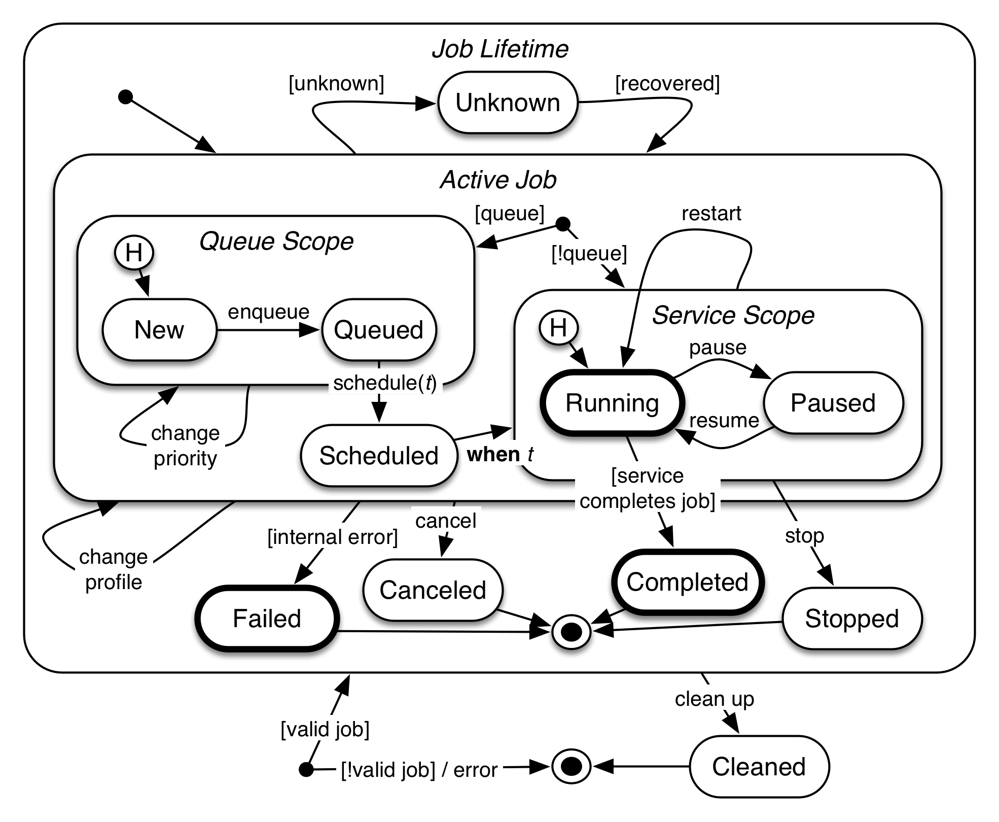
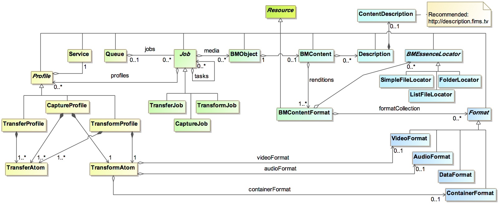

  __EBU Tech 3356__ 
# Specification of the FIMS Media SOA Framework
### General Description - Version 1.3

_Previous_: [High-level architectures](./high-levelArchitectures.md) | _Up_: [Contents](./introduction.md) | _Next_: [Media service awareness](./mediaServiceAwareness.md)

## Media service management

### Service lifecycle

The main lifecycle states of a service are:

* Service deployed
* Service updated
* Service replaced
* Service decommissioned

#### Deployment

A service is deployed when the new service or service instance is registered in the service registry. The information 
provided in the registry includes:

*	Service interfaces.
*	Service endpoint information.
*	Service description metadata.
*	Service policies.

#### Decomissioning

Decommissioning services from the environment is supported by the service registry, which allows the system administrators 
to first deprecate existing implementations so that potential new consumers do not see the specific implementation. 
Administrators can then use reporting and impact analysis capabilities in the service registry to allow the operations 
team to identify remaining service version consumers and ensure that they migrate onto the correct alternative version. 
After all of the consumers have been migrated, the old service version can be retired from use and removed from the
environment.

#### Replacement / upgrade

A service can be updated or replaced by updating the service information in the service registry.

The service interfaces and schemas as specified in this FIMS specification shall not require updating if a service is 
replaced by one providing the same business functionality with the same version of the interface. However, as FIMS 
specifications evolve, new versions of an interface may be published and may need to be updated in the registry. As 
service versions are superseded by new implementations which deliver the same required business capability, the service 
governance lifecycle should allow older versions to be deprecated and, ultimately, retired.

#### FIMS interface versioning

Backward compatibility issues might arise for a variety of reasons. This version of the specification focuses on two 
scenarios:

* There is a new version of the FIMS specifications for a service interface or base schemas.
* A service implementation has been modified for adding or removing features (such as operations).

##### New version of interfaces

From time to time, the FIMS technical board will issue new versions of the FIMS normative schemas and associated 
specifications with a common, incremented version number. Although every effort will be made to make new minor 
version updated to be backwards compatible with previous versions, the nature of FIMS as a bi-directional communication 
framework causes unavoidable issues for implementers, including:

* Mismatched versions of data between that sent to a service and received in a synchronous response; 
* Similarly for notifications sent from services;
* Use of runtime validation and/or auto-generated code that is specific to a schema version.

Services and orchestration systems are not required to provide simultaneous support for multiple versions of FIMS. A 
single service endpoint shall provide support for one and only one version of the FIMS schemas and specifications. A 
service may support more than one version of the FIMS specification through the provisioning of additional endpoints, 
one per version.

The FIMS base services schema contains a simple type called "CurrentVersion" that shall be a string value restricted 
to contain a single value equal to the version number of the schema. For example, the fixed value is "v1_2_0" for FIMS 
version 1.2.

With the exception of FIMS v1.0.7 messages, all FIMS SOAP request messages, response messages, notification messages 
and event messages shall indicate their version number using a mandatory attribute named "version" of "CurrentVersion" 
type. A response message or notification message generated by a service endpoint shall have the same version number as 
that of the endpoint, thereby ensuring that servers and clients support the same version.

As the version attribute was not present in FIMS version 1.0.7, any SOAP request, response or notification message 
that does not contain a version attribute shall be treated as a FIMS 1.0.7 message.

All FIMS REST messages other than fault messages shall contain a mandatory header named "X-FIMS-Version" with a value 
set to the same as the version number of the specification as the fixed value of the "CurrentVersion" simple type.

> Note: No FIMS REST mapping was defined for FIMS 1.0.7, so the legacy issue of a missing version attribute is not an 
  issue for REST services.

So that both REST and SOAP services may receive version-related fault messages, fault messages shall not have a 
version number.

For REST services, if the version number of a message is not supported by the receiving endpoint, it shall be rejected 
with a fault response using code "SVC_S00_0019", indicating a version mismatch. To enable the consumer of the endpoint 
to change the version of their request or route the message to an appropriate endpoint, the fault's message should 
contain details of the current version supported by the endpoint. 

For SOAP services, if it is not possible to differentiate a version mismatch from an invalid XML instance of an xml 
schema, it is recommended that all fault responses with code "DAT_S00_0001" should explicitly state the current version 
of the service in either the description or the detail part of the fault message.

> Note:	It is anticipated that translation endpoint services can be implemented to help users with the process of 
  migration from one version to the next.
  
##### New service implementation

In this scenario there is no change in the version of the interface, but the service is replaced with a different 
implementation in which either only some of the features (e.g. operations) are implemented or additional new features 
are implemented. In the latter case, the service is backward compatible. In the former case, there is the issue of 
making the framework aware that the service is not implementing some features.

The following practices shall be followed:

* Service description for each service implementation provides a list of available service operations and properties 
  (e.g., a transform operation provides a list of supported formats).
* A new service may be invoked through mediation in the ESB or via an orchestration system, in which case a lookup in 
  the service registry can be used to find the service instance(s) that implement the requested operation.

### Job management

#### Lifecycle of a job

The figure below shows the states associated to a long-running job since its request until its completion, cancellation 
or failure. It also shows the job commands or actions that initiates a transition to a new state.

The thick outlines to the circles in the figure above indicate the mandatory states that shall be implemented.

When a job request is received by a service its initial state is either _New_ or _Running_. In the _New_ or _Queued_ state, 
a job may have its priority changed before starting its execution through external job management commands (if the service 
supports these features). The job may also be cancelled by an external command. Once the job is de-queued for execution 
it moves to the _Scheduled_ state and when the scheduled time comes, it moves to the _Running_ state. In case the service 
does not implement the job queue, the job goes directly to the _Running_ state upon the arrival of a request.

The _Running_ state indicates a job is being executed. An external command may pause the job (and resume it later). The 
request may also be restarted or cancelled by external commands. Restarting means to start its execution again. If a 
job executes until its completion it transitions to the _Completed_ state. If an error occurs during its execution it moves 
to the _Failed_ state. An external command may force the early termination of a job execution. To stop a job means to force 
its completion. This is not an error situation and the result of the job processing until that moment is considered to 
be the result of the job execution.

Media services often produce large media files that need to be available until the client or other services retrieve them. 
Once the job completes (or it is stopped) the resulting product of the operation shall be kept by the service. An external 
(or internal) command (cleanup) is used to indicate to the service that the result is no longer needed and the job 
transitions then to _Cleaned_ state. Services may independently move jobs to the _Cleaned_ state after an elapsed time, 
the duration of which is to be determined by the service. Services shall be responsible for cleaning jobs across service 
stop or crash events.

The transition to _Cancelled_, _Completed_, _Stopped_ and _Failed_ states shall produce a notification to the endpoints 
specified at the _notifyAt_ parameter of the request message, if a notification is expected at the end of the job execution 
or at the job cancellation. _Completed_, _Stopped_ and _Cancelled_ shall produce a response notification message to the 
_replyTo_ endpoint, while _Failed_ shall produce an error notification message addressed to the _faultTo_ endpoint.

The _Unknown_ state indicates the job is currently being processed but its state cannot be obtained.

#### Management commands

The FIMS services interfaces provide three job management operations. They are the manageJob, manageQueue and queryJob 
operations, as shown in the figure below.

The _manageJob_ operation allows a requester to send job commands to change the state of a job as described in the previous 
section.

If the service implements a job queue, this queue can be managed using the _manageQueue_ operation. The queue commands and 
the associated state transitions are described in __Section 6.2.1 FIX REFERENCE__.

The _queryJob_ operation returns information about jobs that were submitted to the service. The requester may provide a list 
with the ID of the jobs it wants the information on.

Alternatively, it can request information of jobs that meet requirements specified by a filter object.

The response list contains the identification of the jobs and detailed information about each job such as 
_estimatedCompletionDuration_ and _status_.

#### Resource-oriented data model

Messages exchanged about jobs, the services they perform, their profiles, queues and the objects that they operate on 
conform to a resource-oriented data model. The classes of this data model and their relationships are shown in the UML 
class diagram in the figure below. The non-referential properties of each class are not shown.

Future extension of the FIMS framework is expected to take place through extension of this data model. For example, 
BMObject could be extended to provide different kinds of collections of BMObjects that are used as inputs to, or appear 
as outputs from, services.

Each resource has a unique identifier property "resourceID" that can be used to make reference to it, just like a 
hyperlink. In combination with a means to resolve references, a resource-oriented approach enables the following:

* reference can be made to shared and repeated resources so that smaller messages can be exchanged. For example, a 
  common profile can be defined for a regularly repeated transform operation and stored in a central location. It does 
  not have to be repeated in every job request, response or status query.
* the location of a resource to be separated from its use, facilitating geographic scalability and greater resilience 
  trough the use of resource-resolution technologies such as DNS.
* support for the introduction of data authority services that provide a single point of authority for classes of 
  metadata. For example, a digital asset management system is used as the data authority for information about content. 
  Rather than a copy of the information about the content being kept by each of the systems involved in a job, with all 
  the associated overhead of keeping a copy, reference can be made to the authoritative version in the asset management 
  system.
* a greater degree of loose-coupling, including more agility to introduce loosely-coupled monitoring systems and dashboards.
* RESTful bindings for resources.

An optional "revisionID" property may be used to keep track of revision numbers for a resource, supporting systems that 
use an eventually consistent approach.

An optional URI "location" property may be used to provide a specific location for the resource (URL) that can be referenced 
without the need for resource identifier resolution.

In terms of the normative representation of the data model as an XML schema, all properties for resources are marked as 
optional from an XML perspective (`minOccurs="0"`), with the exception of the "resourceID" property. This mechanism allows 
a resource to be included by reference rather than embedding it.

To encode a reference to a resource rather than embedding it, omit all of its properties other than "resourceID", "revisionID" 
(where used) and "location" (where used). The decoder of the message is then expected to either resolve the reference to the 
resource or report a fault.

To encode a resource by embedding its value, include the value of at least one property other than "resourceID", "revisionID"
and "location". In general, all known property values for a resource are encoded to minimize the requirement to merge versions
of the resource. The decoder is not expected to resolve the resource by reference externally and may update an internal copy 
of the resource based on the information provided.

The use of XML optionality (`minOccurs="0"`) for a property in the XML schema does not imply that the property is optional 
in a FIMS implementation. Properties that are defined as mandatory through specification, in either a request or a response 
message and in at least one job state, must be supported by all FIMS implementations.

> Note: Mandatory properties are in request or response messages are defined per property in the XML schema annotations with 
  source `urn:x-fims:inclusionInRequest` and `urn:x-fims:inclusionInResponse`.
  
FIMS defines both normative technical metadata (e.g., Format, VideoFormat, AudioFormat) and recommended descriptive metadata 
(ContentDescription). Users are encouraged to use the core descriptive metadata provided in the FIMS schema to improve 
interoperability. Both technical and descriptive metadata are based on EBUCore, an EBU extension of the Dublin Core for media.

* * *

_Previous_: [High-level architectures](./high-levelArchitectures.md) | _Up_: [Contents](./introduction.md) | _Next_: [Media service awareness](./mediaServiceAwareness.md)

Copyright 2015 European Broadcasting Union

Copyright 2015 Advanced Media Workflow Association
